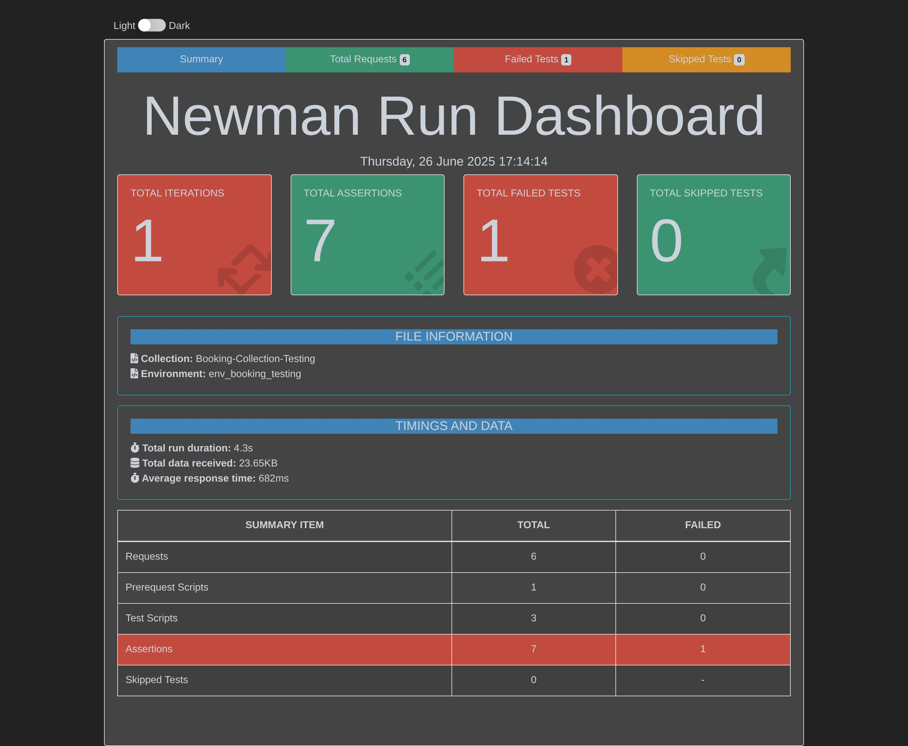
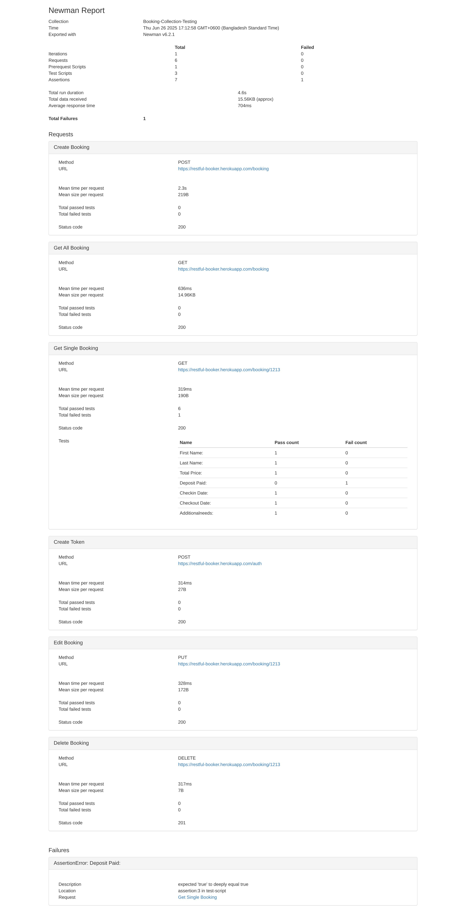

# 🧪 API Testing Project

This project contains automated **API tests** written in JavaScript and Postman.  
It ensures all API endpoints are validated for functionality, performance, and reliability.

### 🧾 Booking API – Postman & Newman Automated Test
This project contains **automated API tests** for the **Booking API**, built and executed using **Postman** and **Newman**.  
The goal of this project is to validate core Booking API functionalities — such as creating, retrieving, updating, and deleting bookings — and to generate a detailed HTML report after execution.

---

## 🚀 Features

- ✅ API test collection for **Booking API**
- 🧪 Automated execution via **Newman**
- 🧰 Integration-ready for CI/CD pipelines (e.g., GitHub Actions, Jenkins)
- 📊 Generates beautiful **HTML test reports**
- 🖼️ Includes visual test result summaries

---

## 🚀 Project Overview

The goal of this project is to automate testing for RESTful APIs.  
It verifies the following key aspects:
- ✅ Status codes and response times  
- ✅ Response body structure and data validation  
- ✅ Authentication and authorization  
- ✅ Error handling and negative test cases  

---

## 🧱 Tech Stack

| Tool | Purpose |
|------|----------|
| **Postman** | Create and organize API test collections |
| **Newman** | Run tests from the command line |
| **Node.js** | Environment for running Newman |
| **GitHub Actions** | (Optional) Automate test execution in CI |

## 📁 Newman Reports (Visual Overview)

### Report Summary

### Detailed Report

